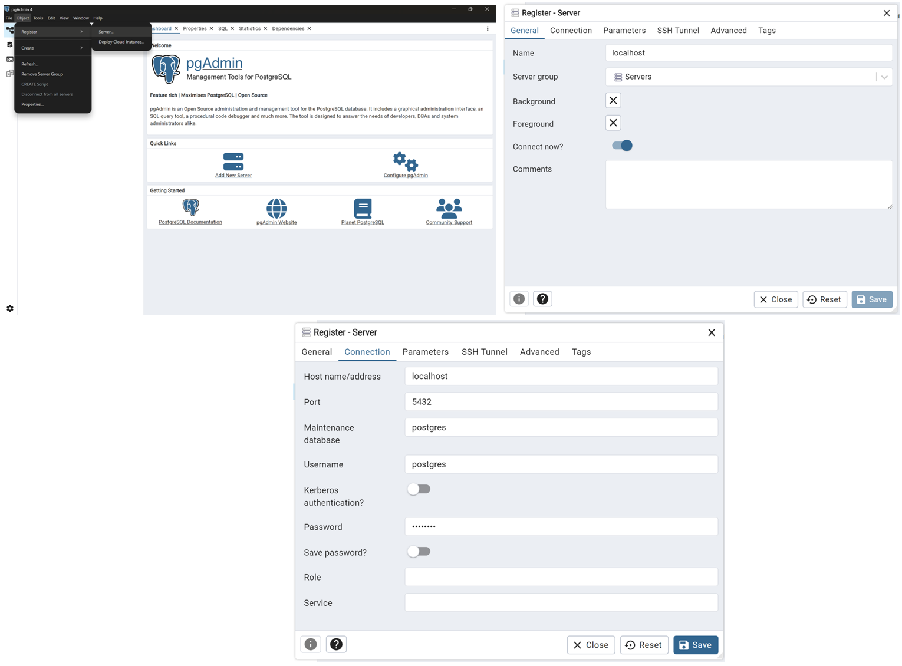
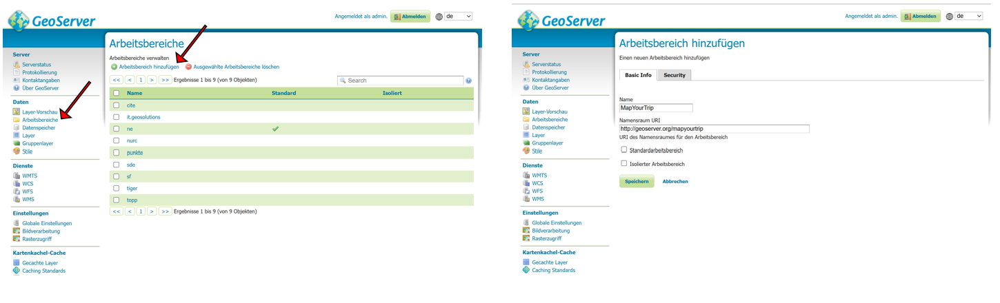
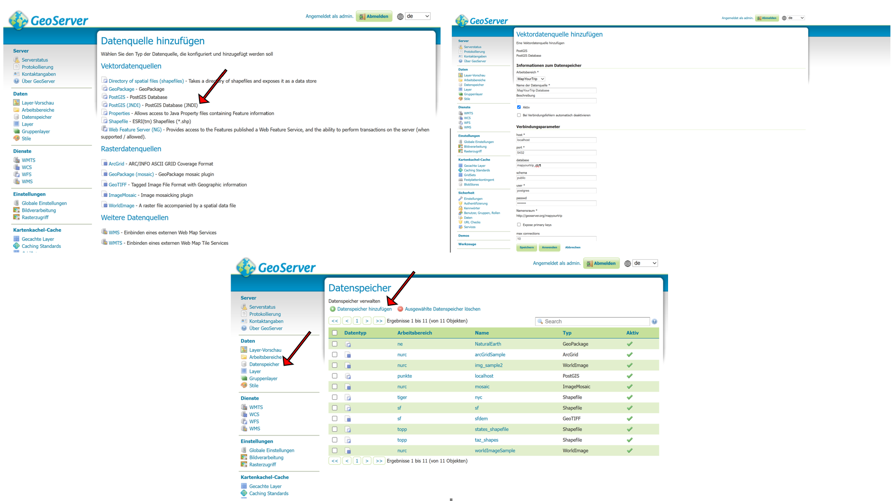
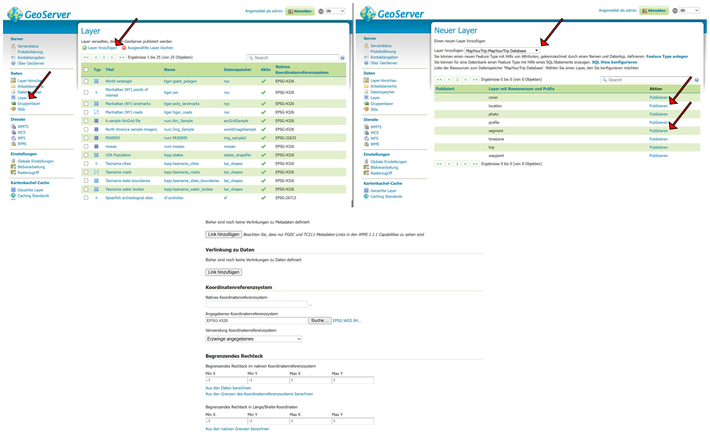

# Map Your Trip

Einleitung zum Projekt

---

Server Client Projekt für die Projektarbeit Map Your Trip im Modul 4230. Die zugehörige Dokumentation ist in den zugehörigen GitHub Pages unter [https://leo4410.github.io/MapYourTrip/](https://leo4410.github.io/MapYourTrip/) dokumentiert.

- **Backend:** FastAPI, GeoServer
- **Frontend:** React.js, OpenLayers und MUI

Getestet mit Node version 22.14.0, openlayers 9.1.0, mapliber 5.1.0, react 18.3.1

## Requirements

- [Git Version Control](https://git-scm.com/)
- [Miniconda](https://docs.conda.io/en/latest/miniconda.html)
- [Node.js und npm](<https://docs.npmjs.com/downloading-and-installing-node-js-and-npm](https://docs.npmjs.com/downloading-and-installing-node-js-and-npm)>)
- [Miniconda](https://docs.conda.io/en/latest/miniconda.html)
- [Node.js und npm](<https://docs.npmjs.com/downloading-and-installing-node-js-and-npm](https://docs.npmjs.com/downloading-and-installing-node-js-and-npm)>)
- [Visual Studio Code](https://code.visualstudio.com/) oder ähnlich

## Repository lokal klonen

Das Projekt über die Git Bash in ein lokales Verzeichnis klonen. Die Git Bash kann in einem beliebigen Verzeichnis mit einem Rechtsklick und daraufhin `Git Bash Here` geöffnet werden.

```shell
git clone git@github.com:leo4410/MapYourTrip.git
cd MapYourTrip
```

## Datenbank installieren

Für dieses Projekt wird ein funktionsfähiger PostgreSQL Server vorausgesetzt. Dieser kann installiert und aufgesetzt und lokal betrieben werden. Unter folgenden link [Postgres](https://www.postgresql.org/download/) downloaden. Wenn noch nicht vorhanden folgende Schritte beachten:

Im Installationsprozess diese Komponenten installieren lassen:

- PostgreSQL Server
- pgAdmin 4
- Stack Builder
- Command Line Tool

Definition von `Password` und `Port` im Postgres-Installation notieren.

Installieren von `PostGIS` in Stackbilder.

## Datenbank erstellen

Die Verbindnung zum Datenbankserver wird über pgAdmin hergestellt und ist nachfolgend beispielhaft beschrieben.



Sobald eine Verbindung zum Datenabankserver besteht, kann die Projektdatenbank aufgesetzt werden.

1. Erstellen einer Datenabank für das Projekt mit pgAdmin


Aufbau der Struktur der Datenbank

1. Erstellen des Datenbank Schemas durch das Ausführen von [db_schema.sql](database/db_schema.sql)
2. Generieren der notwendigen Testdaten durch das Ausführen von [db_insert.sql](database/db_insert.sql)

## Backend installieren

Das Backend des Projekts besteht aus einem FastAPI Backend, als auch einem Geoserver zur Bereitstellung eines WFS.

### FastAPI Backend

---

Damit das FastAPI Backend ordnungsgemäss betrieben werden kann, muss im Verzeichnis `server` eine Datei mit dem Titel `config.json` erstellt werden. Die Datei enthält die Konfigurationsparameter für die Datenbankverbindung.

```shell
{
  "dbname": "mapyourtrip",
  "user": "postgres",
  "password": "postgres",
  "host": "localhost",
  "port": 5432
}
```

**1. Conda Umgebung** für das Projekt mit allen notwendigen Packages aus der [requirements.txt](server/requirements.txt) Datei aufsetzen. Dafür muss eine Anaconda Prompt im geklonten Verzeichnis geöffnet werden

```shell
cd server
conda create -n mapyourtrip_env -c conda-forge python=3.13.0 --file requirements.txt --yes
```

**2. Backend** in der Conda Umgebung **starten** und im Browser unter [http://localhost:8000/](http://localhost:8000/) verifizieren

```shell
conda activate mapyourtrip_env
uvicorn app.main:app --reload
```

### Geoserver

---

Der Geoverver kann unter [Geoserver.com](https://geoserver.org/download/) heruntergeladen werden und eine allgemeine Dokumentation ist hier verfügbar [Link Manual](https://docs.geoserver.org/stable/en/user/index.html).
Bevor der Geoserver für das Projekt konfiguriert werden kann, muss eine laufende Instanz verfügbar sein. Das Aufsetzen eines Geoservers ist in der [Installationsseite](https://docs.geoserver.org/latest/en/user/) beschrieben. In dieser Anleitung wird der Geoserver lokal betrieben.

Die Folgenden Schritte werden hier bei [Dokumentation von Geoserver.com](https://docs.geoserver.org/stable/en/user/data/webadmin/index.html) beschrieben und sind als zusätzliche Unterstützung gedacht zu den Screenshots.

1. Aufrufen von [http://localhost:8080/geoserver/web/?2](http://localhost:8080/geoserver/web/?2) und anmelden auf dem Geoserver


2. Erstellen eines Arbeitsbereiches für das Projekt mit Angabe der folgenden Parameter



```shell
# Name Arbeitsbereich
MapYourTrip
# Namensraum URI
http://localhost:8080/MapYourTrip

```

3. Hinzufügen eines PostGIS Datenspeichers mit Angabe der folgenden Parameter



```shell
# Zusammenfassung der Parameter
# Name Arbeitsbereich
MapYourTrip
# Name Datenquelle
MapYourTrip
# Server
localhost
# Port pgAdmin
<port> # in Postgres definiert
# Datenbankname
mapyourtrip
# Datenbankschema
public # or other
# Benutzer pgAdmin
<username> # bsp postgres
# Passwort pgAdmin
<password> # bsp postgres
```

1. Hinzufügen der Layer Location und Segment zum Geoserver. Beim Publizieren sind die folgenden Parameter anzupassen und das begrenzte Rechteck ist aus den Daten zu berechnen



## Frontend installieren

Das Frontend kann gestartet werden, sobald alle notwendigen Node Packages installiert wurden.

```shell
cd ../client
npm install
npm run start
```

Vor dem Start müssen in der Datei `src/App.js` gegebenenfalls die Backend URIs angepasst werden.

## API-Key Openrouteservice

Über folgendende Homepage kann der API-Key bezogen werden: [OpenRouteService](https://openrouteservice.org/dev/#/api-docs)

Im folgenden Bild ist das Video noch verlinkt:

[](./docs/videos/ORS_API_key.mp4)


# Deployment

Für das Deployment wird ein Linux Debian Server vorausgesetzt. Darauf ist eine PostgreSQL Installation und eine Geoserver Installation vorhanden. 

## Voraussetzungen

Als Hilfestellung zum Aufsetzen der Linux Debian Umgebung, ist nachfolgend die Installation der Voraussetzungen beschrieben.

### Python

Grundsätzlich findet sich in Debian eine Python Installation. Sollte diese nicht vorhanden sein, kann Python mit diesen Befehlen installiert werden. 
```shell
sudo apt update
sudo apt install python3
```
Zusätzlich sollten die folgenden Installationen ausgeführt werden.
```shell
sudo apt install -y python3-pip python3-venv libpq-dev build-essential
```

### PostgreSQL

PostgreSQL kann über die Installatinosanleitung auf der [Webseite](https://www.postgresql.org/download/linux/debian/) installiert werden. Nach der erfolgreichen Installation ist es notwendig, die PostGIS [Installation](https://www.enterprisedb.com/docs/postgis/latest/installing/linux_x86_64/postgis_debian_12/) hinzuzufügen. Nach der Installation empfiehlt es sich mit folgenden Befehlen, dem standardmässig erstellten Benutzer ```postgres``` ein neues Passwort zu vergeben.
```shell
sudo –u postgres psql postgres
\password postgres
```
Im Anschluss kann der Server mit ```sudo systemctl start postgresql.service``` gestartet werden.

### Geoserver

Eine Installationsanleitung zum Geoserver ist unter diesem [Link](https://docs.geoserver.org/main/en/user/installation/linux.html) zu finden. Es ist zu beachten, dass es nach der Installation notwendig ist, eine korrekte CORS Konfiguration vorzunehmen. Diese ist ebenfalls auf der Geoserver [Webseite](https://docs.geoserver.org/main/en/user/production/container.html#enable-cors-for-jetty-binary-installer) beschrieben. Der Geoserver wird mit ```sudo sh startup.sh``` gestartet, nachdem man in das Installationsverzeichnis gewechselt hat, welches unter diesem Pfad liegt ```/usr/share/geoserver/bin```. 

### NodeJS

Für die Installation von NodeJS kann die entsprechende [Anleitung](https://nodejs.org/en/download) beachtet werden. Als Konfigurationsparameter aud der Webseite wird ```for Linux use nvm with npm``` empfohlen.

### Git Repository

Auch auf dem Server ist das Git Repository des Projekts herunterzuladen.
```shell
git clone git@github.com:leo4410/MapYourTrip.git
```

## Datenbank

Das Vorgehen zur Erstellung der projektspezifischen Datenbanken entspricht grundsätzlich demjenigen aus dem Kapitel zur [lokalen Datenbankinstallation](#datenbank-installieren). Um die Verbindung von pgAdmin zur Datenbank auf dem Server herzustellen, müssen die entsprechenden Benutzerdaten, als auch die korrekte IP-Adresse des Servers verwendet werden. Die IP-Adresse des Servers ist einsehbar, durch Eingabe des Befehls ```ifconfig``` auf dem Datenbankserver.

## Backend

Um die laufenden Instanzen von Backend und Frontend zu handhaben, empfiehlt es sich vorgängig über ```npm``` einen Prozessmanager wie [pm2](https://pm2.keymetrics.io/) zu installieren.
```shell
npm install pm2 -g
```

### Fast API Backend

Damit das FastAPI Backend ordnungsgemäss betrieben werden kann, muss im Verzeichnis `server` des [Git Repositories](#git-repository) eine Datei mit dem Titel `config.json` erstellt werden. Die Datei enthält die Konfigurationsparameter für die Datenbankverbindung.

```shell
{
  "dbname": "{your_mapyourtrip_db}",
  "user": "{your_postgres_user}",
  "password": "{your_postgres_password}",
  "host": "{your_server_ip}",
  "port": 5432
}
```

Gegebenenfalls muss in der Datei ```server/app/main.py``` die IP-Adresse des Servers auf Zeile 38 ergänzt werden, um die CORS zu erlauben.

Virtuelle Umgebung für das Projekt mit allen notwendigen Packages aus der [requirements.txt](server/requirements.txt) Datei aufsetzen

```shell
cd server
python3 -m venv mapyourtrip_env
source mapyourtrip_env/bin/activate
pip install -r requirements.txt
deactivate
```

Um das Backend mit ```pm2``` starten zu können, muss die Datei ```start_fastapi``` angepasst werden. In der Datei ist auf Zeile 2 und 3 der absolute Pfad der vorher erstellten virtuellen Umgebung anzugeben. Im Anschluss an diese Anpassung kann mit ```pm2 start ./start_fastapi.sh --name mapyourtrip_be``` das Backend gestartet und im Browser unter ```http://{your_server_ip}:8000/``` verifiziert werden. 

### Geoserver

Die Installation des Geoserver entspricht grundsätzlich der [Installation](#geoserver) in einer lokalen Umgebung. Grundsätzlich muss der localhost für den Datenbankzugriff nicht durch eine IP-Adresse ersetzt werden, da die Datenbank und der Geoserver auf derselben Maschine laufen. 

## Frontend

Auch das Frontend kann über ```pm2``` betrieben werden. Vor dem Bauen der Applikation müssen in der Datei `src/App.js` gegebenenfalls die Backend URIs angepasst werden. Daraufhin müssen die folgenden Befehle ausgeführt werden, um das Frontend zu einem Paket zusammenzustellen. 

```shell
cd ../client
npm run build
```

Mit dem nachfolgenden Befehl wird das Frontend schliesslich in ```pm2``` gestartet.

```shell
pm2 start serve --name mapyourtrip_fe -- -s build -l 5173
```
