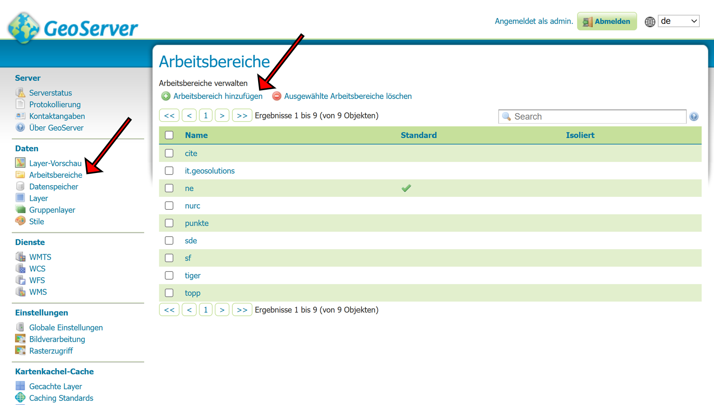

# Map Your Trip

Server Client Projekt für die Projektarbeit Map Your Trip im Modul 4230. Die zugehörige Dokumentation ist in den zugehörigen GitHub Pages unter [https://leo4410.github.io/MapYourTrip/](https://leo4410.github.io/MapYourTrip/) dokumentiert.

- **Backend:** FastAPI, GeoServer
- **Frontend:** React.js, OpenLayers und MUI

Getestet mit Node version 22.14.0, openlayers 9.1.0, mapliber 5.1.0, react 18.3.1

## Requirements

- [Git Version Control](https://git-scm.com/)
- [Miniconda](https://docs.conda.io/en/latest/miniconda.html)
- [Node.js und npm](<https://docs.npmjs.com/downloading-and-installing-node-js-and-npm](https://docs.npmjs.com/downloading-and-installing-node-js-and-npm)>)
- [Miniconda](https://docs.conda.io/en/latest/miniconda.html)
- [Node.js und npm](<https://docs.npmjs.com/downloading-and-installing-node-js-and-npm](https://docs.npmjs.com/downloading-and-installing-node-js-and-npm)>)
- [Visual Studio Code](https://code.visualstudio.com/) oder ähnlich

## Repository lokal klonen

Das Projekt über die Git Bash in ein lokales Verzeichnis klonen. Die Git Bash kann in einem beliebigen Verzeichnis mit einem Rechtsklick und daraufhin `Git Bash Here` geöffnet werden.

```shell
git clone git@github.com:leo4410/MapYourTrip.git
cd MapYourTrip
```

## Datenbank installieren

Für dieses Projekt wird ein funktionsfähiger PostgreSQL Server vorausgesetzt. Dieser kann gegebenenfalls gemäss [IGEO Installationsanleitung](docs/documents/Installationsanleitung_PostgreSQL_PostGIS_PGAdmin_IGEO.pdf) aufgesetzt und lokal betrieben werden. Die Verbindnung zum Datenbankserver wird über pgAdmin hergestellt und ist nachfolgend beispielhaft beschrieben.

 
 

  

Sobald eine Verbindung zu einem Datenabankserver besteht, kann die Projektdatenbank aufgesetzt werden.
Sobald eine Verbindung zu einem Datenabnkserver besteht, kann die Projektdatenbank aufgesetzt werden.

1. Erstellen einer Datenabank für das Projekt

 

1. Erstellen des Datenbank Schemas durch das Ausführen von [db_schema.sql](database/db_schema.sql)
2. Generieren der notwendigen Testdaten durch das Ausführen von [db_insert.sql](database/db_insert.sql)

## Backend installieren

Das Backend des Projekts besteht aus einem FastAPI Backend, als auch einem Geoserver zur Bereitstellung eines WFS.

### FastAPI Backend

Damit das FastAPI Backend ordnungsgemäss betrieben werden kann, muss im Verzeichnis `server` eine Datei mit dem Titel `config.json` erstellt werden. Die Datei enthält die Konfigurationsparameter für die Datenbankverbindung.

```shell
{
  "dbname": "mapyourtrip",
  "user": "postgres",
  "password": "postgres",
  "host": "localhost",
  "port": 5432
}
```

1. Conda Umgebung für das Projekt mit allen notwendigen Packages aus der [requirements.txt](server/requirements.txt) Datei aufsetzen. Dafür muss eine Anaconda Prompt im geklonten Verzeichnis geöffnet werden

```shell
cd server
conda create -n mapyourtrip_env -c conda-forge python=3.13.0 --file requirements.txt --yes
```

2. Backend in der Conda Umgebung starten und im Browser unter [http://localhost:8000/](http://localhost:8000/) verifizieren

```shell
conda activate mapyourtrip_env
uvicorn app.main:app --reload
```

### Geoserver

Bevor der Geoserver für das Projekt konfiguriert werden kann, muss eine laufende Instanz verfügbar sein. Das Aufsetzen eines Geoservers ist in der [Installationsanleitung von Pia Bereuter](docs/documents/4230_E03_Geoserver.pdf) beschrieben. In dieser Anleitung wird der Geoserver lokal betrieben.

1. Aufrufen von [http://localhost:8080/geoserver/web/?2](http://localhost:8080/geoserver/web/?2) und anmelden auf dem Geoserver


2. Erstellen eines Arbeitsbereiches für das Projekt mit Angabe der folgenden Parameter

 

```shell
# Name Arbeitsbereich
MapYourTrip
# Namensraum URI
http://localhost:8080/MapYourTrip

```

3. Hinzufügen eines PostGIS Datenspeichers mit Angabe der folgenden Parameter

  

```shell
# Name Arbeitsbereich
MapYourTrip
# Name Datenquelle
MapYourTrip
# Server
localhost
# Port
5433 
# Datenabnkname
mapyourtrip
# Datenbankschema
public
# Benutzer pgAdmin
postgres
# Passwort pgAdmin
postgres
```

1. Hinzufügen der Layer Location und Segment zum Geoserver. Beim Publizieren sind die folgenden Parameter anzupassen und das begrenzte Rechteck ist aus den Daten zu berechnen

  

## Frontend installieren

Das Frontend kann gestartet werden, sobald alle notwendigen Node Packages installiert wurden.

```shell
cd ../client
npm install
npm run start
```

Vor dem Start müssen in der Datei `src/App.js` gegebenenfalls die Backend URIs angepasst werden.

## API-Key Openrouteservice

Über folgendende Homepage kann der API-Key bezogen werden: [OpenRouteService](https://openrouteservice.org/dev/#/api-docs)

Im folgenden Video ist noch Visualisiert wie genau.

<video src="https://github.com/leo4410/MapYourTrip/blob/main/docs/videos/ORS_API_key.mp4" width="600" controls></video>
