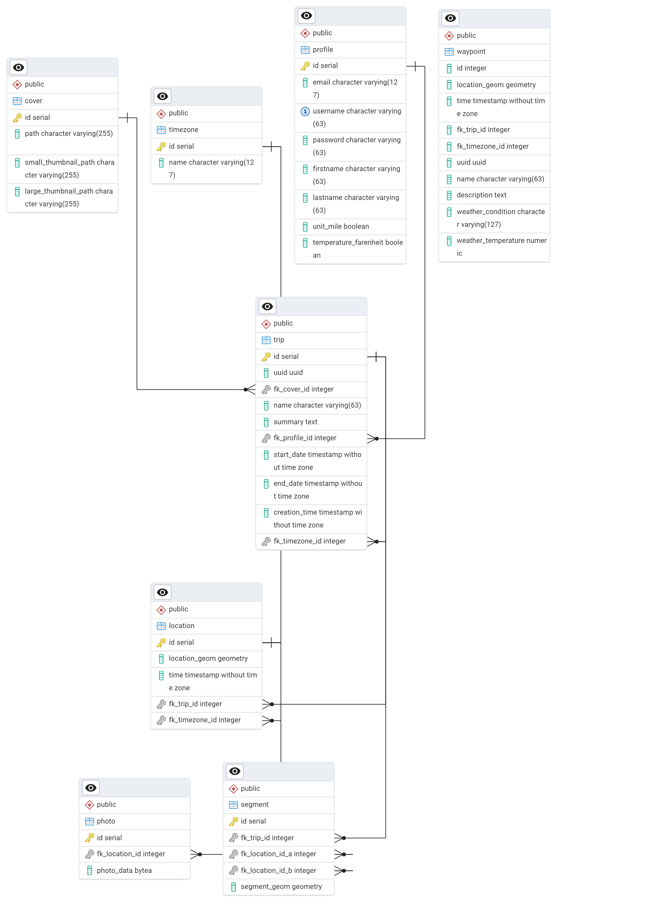

## MapYourTrip Server

Der Server besteht aus einer **PostgreSQL Datenbank** (PostGIS), einem **FastAPI Backend Schnittstelle** und einem **Geoserver**.

### PostGIS Database

Die PostgreSQL Datenbank mit der PostGIS Erweiterung speichert die Daten in verschiedenen Tabellen. Für das Projekt sind die nachfolgenden Tabellen von zentralen Bedeutung. Diese Datenbank eignet sich für die speicherung von Räumlichen Daten wie die Punkte und Segmente.

- `location` speichert Punktdaten, die aus Polarsteps exportiert wurden
- `segment` speichert Liniendaten, welche die Punkte aus Polarsteps miteinander verbindet
- `trip` ordnet Punkt- und Linien einer Reise aus Polarsteps zu

Die weiteren Tabellen haben momentan keinen Einfluss auf das Projekt und können bei einer allfälligen Erweiterung der Applikation zur Speicherung der entsprechenden Daten genutzt werden. Im nachfolgenden Datenbankschema sind alle Beziehungen abgebildet (mit Linkscklick kann das Bild vergrössert werden).

### FastAPI Backend Schnittstelle

Das Backend stellt die folgenden API Endpunkte zur Verfügung.

- `location/{location_id}` als GET Abfrage einer Location
- `segment/{segment_id}` als GET Abfrage eines Segments
- `segment/{segment_id}/route` als POST Abfrage zur neuen Routenberechnung und Speicherung eines Segments
- `trips` als GET Abfrage aller Trips
- `upload/zip` als POST Abfrage zum Upload einer ZIP Datei

Eine detaillierte API Dokumentation ist nach dem Starten des Backends [Starten des Backends](https://github.com/leo4410/MapYourTrip/) gemäss Installationsanleitung unter [http://localhost:8000/docs](http://localhost:8000/docs) einsehbar.

### Geoserver

---

GeoServer ist eine Open-Source-Server-Software zum Verwalten, Veröffentlichen und Austauschen von Geodaten. Es ermöglicht dir, räumliche Daten (z.B. Karten, Luftbilder, Vektordaten) übers Internet bereitzustellen und zu bearbeiten.

- Open Source: Kostenlos, große Community

- Datenquellen: Unterstützt viele Formate (Shapefile, PostGIS, GeoTIFF, usw.)

- Plattform: Web-basiert, läuft auf Java

Der GeoServer stellt diverse Daten im OGC-Standart bereit und gewährt so die Interoperabilität zwischen den verschiedenen Anwendungen. So können beispielsweise folgende OGC-Standarts mit GeoServer abgedeckt und bereitgestellt werden:

- WMS (Web Map Service):
  Stellt Kartenbilder (z.B. PNG/JPEG) aus Geodaten bereit, die sich in andere Anwendungen oder Webseiten einbinden lassen.

- WFS (Web Feature Service):
  Liefert Vektor-Features (also Geometrien + Attribute) als maschinenlesbare Daten (z.B. GeoJSON, GML), die weiterverarbeitet werden können.

- WCS (Web Coverage Service):
  Dient dem Austausch von Rasterdaten (z.B. Satellitenbilder, Höhenmodelle).

- CSW (Catalog Service for the Web):
  Ermöglicht die Suche nach Geodaten(-Diensten) über Metadaten-Kataloge.

Der GeoServer ist somit ein leistungsfähiger Server zur Verteilung von Geodaten und setzt die offenen OGC-Standards um, wodurch ein flexibler, standardisierter Austausch von **Karten**, **Features** und **Rastern** über das Internet/Schnittstelle möglich wird.

---

Der Geoserver wird genutzt, um die **Punkt- und Liniendaten** der Segmente bereitzustellen. Eine beispielhafte Abfrage von Segmenten des Trips mit der Id 3 sieht wiefolgt aus.

`http://localhost:8080/geoserver/wfs?service=WFS&version=1.1.0&request=GetFeature&typename=MapYourTrip:segment&outputFormat=application/json&srsname=EPSG:4326&CQL_FILTER=fk_trip_id=2`
