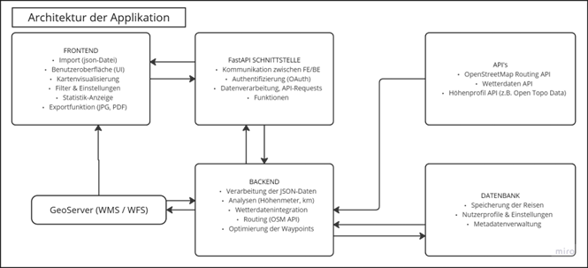

## MapYourTrip

  

MapYourTrip ist Ihre individuelle Reiseverwaltung für Polarsteps-Daten.
Mit der Web­applikation können Sie Ihre exportierten Reise-Logs ganz nach Ihren Wünschen filtern, in einer eigenen Datenbank ablegen und übersichtlich visualisieren. Nutzen Sie die interaktive Kartenansicht um die Karten nach Ihren wünschen zu visualisieren und für ein Fotoalbum zu exportieren.

        <video width="900"   controls>
    <source src="videos/Home_video.mp4" type="video/mp4">
    </video>

### Architektur der Webapplikation

  

    

Die Webaplikation bestehet aus einer Frontendkomponente, Backendkomponente inklusive Datenbank sowie einigen Schnittstellen.

#### Funktionalitäten

Im Reiter **Funktionalitäten** ist pro Arbeitsschritt / Funktionalität ein Kurzvideo ersichtlich. Diese dienen als Kurzanleitung und Übersicht der Möglichkeiten der Webapplikation.

- **01 – Vorbereitung Polarsteps-Daten:**  
  [Zur Anleitung »01_Polarsteps«](01_Polarsteps.md)  
  Wegleitung zum Download deiner Polarsteps-Daten

- **02 – Upload der Reisedaten auf MapYourTrip:**  
  [Zur Anleitung »02_Reiseverwaltung«](02_HomePage.md)  
  Reiseverwaltung und Hochladen von neuen Reisen

- **03 – Visualisierung des Karteninhaltes und Export einer Karte:**  
  [Zur Anleitung »03_Kartenbereich«](03_MapPage.md)  
  Wegleitung für die veränderung der hintergrundkarte, Anpassung der Visualisierung der Routenelementen, Optimierung der Route an das Verkehrsnetz und Export eines Bildes der Karte

- **04 – Erstellen von Statistiken über die Reise:**  
  [Zur Anleitung »04_Statisitk«](04_StatPage.md)  
  Wegleitung für das erstellen von Statistiken über die Reise. Auslessen von Höheninformationen, Längen und Koordinaten.

#### Server
Im Reiter [Server](backend.md) ist die Datebbankstrukctur in der Postgis Datenbank erläutert sowie das FastAPI Backend für die Datenbank abfragen und der Geoserver als Schnittstelle von dem Backend zu dem Frontend.  

#### Client
Im Reiter [Client](frontend.md) werden die Komponenten / Pages des Frontend dokumentiert sowie die verwendeten Bausteine für den Aufbau des Frontends (React, Node Package Manager und Opne Layers).

#### Schnittstellen
Unter [Schnittstellen](Schnittstellen.md) ist die externe Schnittstelle zum OpenRouteService dokumentiert.

### Github Repository und README

Das GitHub Repository dient dem Bezug des original Programmcodes. In der zugehörigen README Datei ist eine Installationsanleitung für das Backend und für das Frontend abgelegt.

- GitHub Repository: [https://github.com/leo4410/MapYourTrip](https://github.com/leo4410/MapYourTrip)
- README: [https://github.com/leo4410/MapYourTrip/blob/main/README.md](https://github.com/leo4410/MapYourTrip/blob/main/README.md)

### Quellen der Hintergrundkarten

Die Hintergrundkarten wurden von folgenden Quellen bezogen. 

- OpenSteetMap [OSM](https://www.openstreetmap.org/about)
- Weltluftbildkarte von [Arcgis](https://www.arcgis.com/home/item.html?id=10df2279f9684e4a9f6a7f08febac2a9)
- Kartendarstellung in Wasserfarben Optik von [maps.stamen.com](https://maps.stamen.com/watercolor/#12/37.7706/-122.3782)
- Kartendarstellung mit Terrain im natürlichen Farben von [maps.stamen.com](https://maps.stamen.com/terrain/#12/37.7706/-122.3782r)
- Mnimalistische Basis Kartendarstellungen von [CARTO](https://carto.com)

### Authoren

© 2025 Leonardo Seminatore, Marco Stampfli, Janis Kramer
